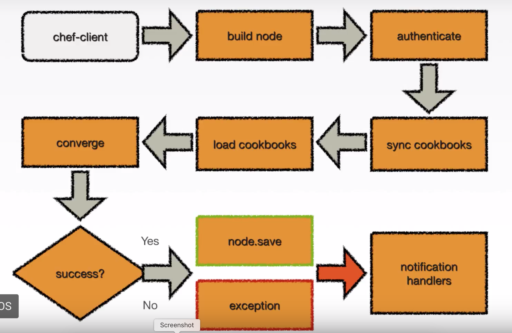

# What happens during a chef-client run

Notes from YOUTUBE video: [Beyond Chef Essentials - What Happens During a chef-client run](#https://youtu.be/egzmSVVP0rg)

## chef-client run flow

# The flow:
1. chef-client
   1. <b>build node:</b> First time we run/load the node's information
      1. Load client.rb
      2. Run Ohai!
         1. node_name
         2. platform
         3. platform_version
         4. ... and more
   2. <b>authenticate</b>: we use the key and communicate to chef-server
   3. <b>sync cookbooks</b>: expanded run list (recipes)
      1. Based on run list provided request/provided by chef server
      2. Places cookbooks on var/chef/cache (if already there, don't download cookbook)
   4. <b>load cookbooks</b>: This is where it will load all cookbooks from run list and load them into memory
      1. Resource Collections: where we add all the resources from cookbooks (Our Groceries list)
         1. packages
         2. services
         3. files
         4. ... and more, like a TODO list
      2. NOTE: The resource collection is executed in order
   5. <b>converge</b>: take `resource collection` and build it all up:
      1. Load resource collection
      2. Execute each resource in resource collection
   6. **Success**?
      1. **YES**: node.save
         1. Goes from the node to the chef server, sends the node object (json representation of the object itself) with all the information
      2. **NO**: exception
         1. **Stop**, we have an error and it will not continue, so any resource after the place where the execution failed wont be executed. 
   7. **Notification Handlers**: Upon success/failure a notification will be executed. 