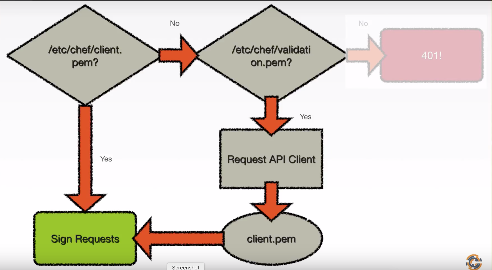

# What is the security model used by chef-client

After bootstrapping a node we run `chef-client` to have it connect with the Chef server. One of the most important steps in the `chef-client` process is the authentication model. 

Notes from YOUTUBE video: [Beyond Chef Essentials - What is the Security Model Used by chef-client](#https://www.youtube.com/watch?v=Gj5pSVpKV4M)

## FLOW:

