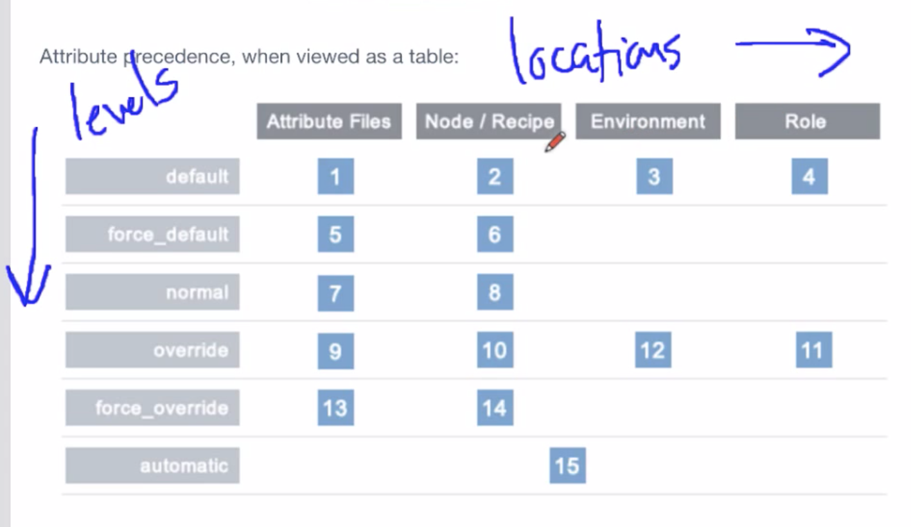

# Attribute precedence explained

Attributes play an important role in how your systems are configured. Cookbooks typically provide *default values* for node attributes they define

Notes from YOUTUBE video: [Beyond Chef Essentials - Attribute precedence explained](#https://www.youtube.com/watch?v=Gj5pSVpKV4M)

